# Yeoman

> [Modern workflow for modern webapps](http://yeoman.io)

<ul style="margin-top: 60px;">
  <li> WebApp Development Today
  <li> Yeoman Introduction
  <li> Project Activity
  <li> Features
  <li> Demo
</ul>

## Web App development today

---

  Many Tools to choose from
  ~ <a href="http://dl.dropbox.com/u/70775642/talks/tooling/fronteers/index.html#13">Addy Osmani</a>

---

  Craftsmanship is choosing tools well.
  
    Difference between a developer that spends 45 minutes getting workflow setup for project and one that spends only 5.
  
  ~ <a href="http://dl.dropbox.com/u/70775642/talks/tooling/fronteers/index.html#10">Addy Osmani</a>

---

> We're seeing the emphasis shift from valuing trivia to valuing tools
> ~[Rebecca
> Murphey](http://rmurphey.com/blog/2012/04/12/a-baseline-for-front-end-developers/)

## Introducing Yeoman

---

---

---

---

---

<em style="display: block;">... and me...</em>

## Project activity

This is where we show the numbers! (and beautiful graphs :p)

<ul>
  <li>https://github.com/yeoman/yeoman/graphs
</ul>

### Commit activity

https://github.com/yeoman/yeoman/graphs/commit-activity

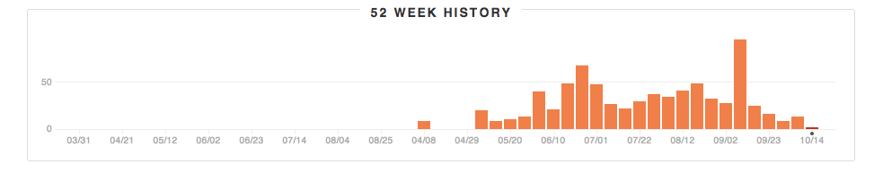

### Code Frequency

https://github.com/yeoman/yeoman/graphs/code-frequency

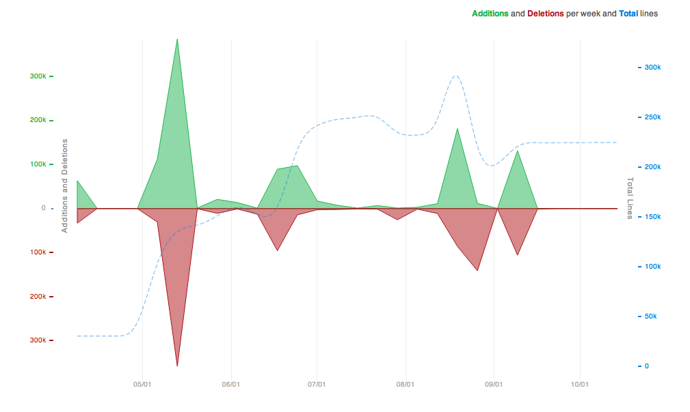

### Punch Card

https://github.com/yeoman/yeoman/graphs/punch-card

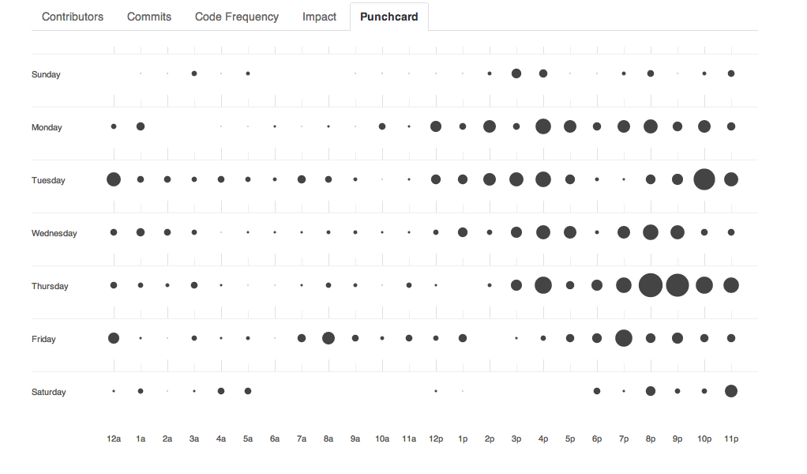

## My implication

- bla
- bla
- bla

## Commits

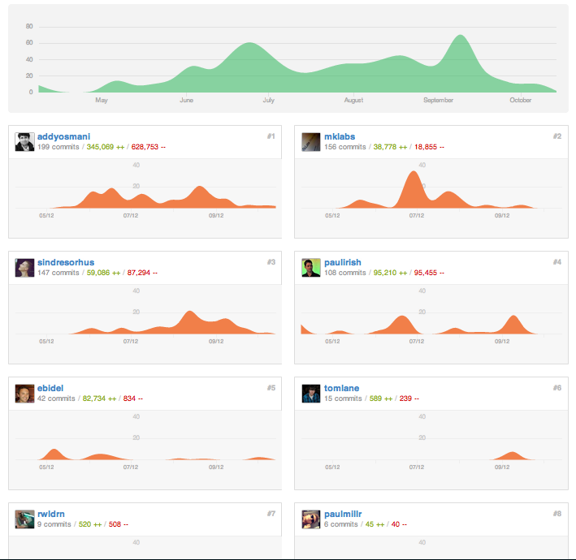

## Commit log

`git contrib self`

Mickael Daniel (176):
      Add `--noprompt` option for init task to bypass all the prompts
      Slight changes to the cli tests
      Rework the test helpers to setup the .test dir before each tests
      Tests for the build:* tasks (and default one)
      Css task - do the minification once inline imports are done
      Tests for the css task
      Tests for the html task
      Tests for the img task
      Tests for the tar task
      Usemin task - Rework the task to also do the replacement in stylesheets
      Tests for the usemin task
      Tidy up the cli test/fixtures files
      Remove old init task and related files, now using yeoman init template
      Change default init template to yeoman's, when yeoman init is run
      Add a new init template, with remotes/* project repo handler
      npm i grunt-jasmine-task -S
      Load jasmine task from our node_modules
      Add jasmine 1.2.0 files to be copied during init task
      Add the according Jasmine runner and environment
      init - Minor fix to the Gruntfile template
      test - update fixtures, make sure to merge defaults
      Rework the server task to be livereload compatible
      init - tweaks to defaults template and remotes to bypass during tests
      test - increase mocha timeout (mostly for first run / remote fetch)
      bin - bypass insight prompt when run as test
      test - update init assertions to catch up with the new init structure
      test - fix img test, add expected .gitignore file for img dir
      test - fix css test, check against main.css, update expected file
      test - fix usemin test, update revision of files for expected fixtures
      A start on this generator idea, really rails inspired.
      Initial internal plumbing for loading in and starting generators
      Add a bit of Grunt API available in generators, and a first controller
      Add argument API for generators, creates an attribute getter for it.
      Add a NamedBased generator to extend from
      Further work on the generator API, ensure source / dest path
      yeoman application generator stub
      Initial support of hook mechanism for generators (basic)
      sass generators, copying compass_twitter_bootstrap to destination
      Generator API for directory copy, add generator app hooks
      shorter directory copy src / dest dance
      Make sure to prevent generator from running on missing argument
      Show help on missing required argument, USAGE file if any
      Also show help if --help was specifically passed
      Fixup the description and generator name for default desc
      Help output and list available generators
      Merge branch 'master' of github.com:yeoman/yeoman into generators
      Add `new` command. Shortcut for yeoman generate app
      Keep track of loaded path to print them when no generator were found
      Process each files during directory copy as _ template
      warn user if they miss yeoman installed locally
      Also expand to hidden files during directory copy
      Add a Generator Generator.. :)
      Add a js-framework hook, prevent loading of name only
      Bootstrap generator
      Load in generators from a yeoman-* npm module
      Merge remote-tracking branch 'upstream/master' into generators
      Few tweaks: bootstrap usage file, load for name only when no lookups
      Fix help output and generator list generators loaded twice
      Add `g` as an alias to `generate`
      A start on ember generators, bootstrap and view are functional
      Slightly better log output, file write and invoke at least
      Do the verbose flag switch at grunt.file.write level
      Few doc updates
      Better log output
      Removed handlebars generator, might readd if we hookFor "template-engine"
      Support `as` option on hookFor
      Renamed bootstrpa generator to js, and moved up to yeoman's dir
      Finish up the ember.js generators (mostly inspired from ember-rails)
      hook for js-framework in app generator
      Add the jasmine generator to setup the test/ directory
      Mocha app generator
      Missing lib/ prefix on assetion library in mocha templates
      deps: Add grunt-mocha
      Mocha generator - fix the runner in headless env, new api.
      Add a basic suite (to be replace by app specs) to the generated mocha env
      Have the generated app Gruntfile to atcually use the test-framework property
      Coffee support for generators
      Merge remote-tracking branch 'upstream/master' into generators
      Merge remote-tracking branch 'upstream/master' into generators-coffee
      Update paths to match the new file structure
      Minor updates to generated gruntfile, comments.
      App generator index.html file, basic copy.
      Fixing the use of new thing/, cleaning name and reworked arguments a bit
      Fix index.html copy location (must be below app/)
      First work on usemin-handler based off necolas idea / initial work
      Trigger the reving of files on usemin-handler
      Trigger rjs:optimizer on data-main with usemin-handler
      Add sample file for usemin-handler tests
      Add desc method, and usage / description with help output
      Hide mocha:app and few tweaks to lookup paths
      App generator - clean trailing slash only when name provided
      Add option method and better help output based on arguments / options
      Update ember generators USAGE files and array option
      General options in Base constructor via option method
      Changed the way hookFor invokes other controller, must be used in ctor
      Follow up hooks and output their options with help
      Dasherize mocha generator options
      First batch of doc updates for generators
      Generate manpages via ronnjs, add a doc/ dir and generated man/ folder
      Merge branch 'generators-coffee' into generators
      Get back to js for app generator
      Async handler for generators (and hooks). Use this.async()
      Added new generator methods: tarball, fetch and remote
      Merge remote-tracking branch 'upstream/master' into generators
      generators - fixing the undefined config when "hooked" for
      generators - hookFor must be used within the constructor only
      init - delegate the groundwork of scaffolding to the generator layer
      generators - add helper, prompt, promptFor, promptForObj API
      generators - few fix / tweaks
      Merge remote-tracking branch 'upstream/master' into generators-test
      generators - Initial tests for generators
      generators - test for generators, 76 tests with 69 pendings..
      generators - init / invoke should return the specified generator all the way through
      generators - generators.prepare/init tests. init still has some pendings
      deps - remove reference to ncp
      deps - remove direct references to underscore, use grunt.util._
      deps - remove direct references to async, use grunt.util.async
      generators - minox fix in simpleapp gen with async handler, and _.humanize
      deps - match connect / prompt deps to the exact same version than grunt's deps
      Merge remote-tracking branch 'upstream/master' into dep-tree
      tasks - server, minor change to instanceof check
      test - initial work on the test refactoring
      test - Add a Runnable object helper to help with cli prompts / output asserts
      generators - Minor changes to wiring.js
      generators - wiring: API to generate attributes from hash options
      generators - Minor changes to simpleapp generated index.html file
      generators - simpleapp rjs fetch,  change to rjs config
      tasks - cleanup build targets a bit and slightly change inspect helper
      tasks - move tasks/h5bp.js -> tasks/yeoman.js
      tasks - html, minor changes to match new inspect helper api
      tasks - rjs changes to allow name / out config, rm sandbox for paths
      tasks - usemin-handler, log blocks & config, tweaks to amd match
      test - allow multiple expectations with runnable helper
      tasks - updates manifest / server task & helpers
      tasks - print the list of task to run in build task
      test - test most of the expected stdout result for the build task
      test - cleanup the test/ directory
      minor changes to conform to code style
      test - runnable, also attach stderr or stdout to errors raised
      tasks - bower, reworked the task to use bower programmatically
      package.json - force engine to 0.8.0 and above
      deps - switch bower deps to npm
      generators - change bower.dir to app/js/vendor in simpleapp Gruntfile
      test - slighly more global regexp on expected prompt and rjs output
      test - remove --silent flag from npm test
      manifest - force path.resolving of path to avoid Forbidden error
      manifest - better test expectation for the manifest task
      generators - move defaulting logic for simpleapp to grunt template layer
      generators - ability to warnOn at runtime, per generator
      test - generators actions
      test - generators base
      test - udpate globals and remove $ as implied
      jshint - minor changes in bower / manifest tasks for unused variables
      server - slight changes to server task to also serve files from temp/
      server - change target prod -> dist
      server - setup some error handling, per target basis if needed
      build - slight change in tasks ordering, clean coffee compass mkdirs ...
      server - add a new "reload" task, prevent browser opening and force port to 35729
      test - make them pass
      Fix tests - make them work without PhantomJS and Compass
      tests - remove generators tests, now in their own repo
      test - replace stdout checks and test against the file system
      Make sure it pass with env without compass installed
      test - add tests for bower task
      test - add implied globals from es6-collection
      test - add implied globals from cheerio
      test - add tests asserting path dependant configuration values
      misc - get rid of yeoman.utils
      config - Add initial bits of config logic, based on config-chain
      config - add defaults and process config keys as a template if necessary
      config - pass config snapshot as generators options
      generator - wrap init into try / catch, ensure exists on error
      manifest - use phantomjs helper instead of spawn
      config - updates to rjs task and proper config init on build
      server - updates to pull path values from config
      server - pass server:* target to internal yeoman-server:*

## Pull Requests

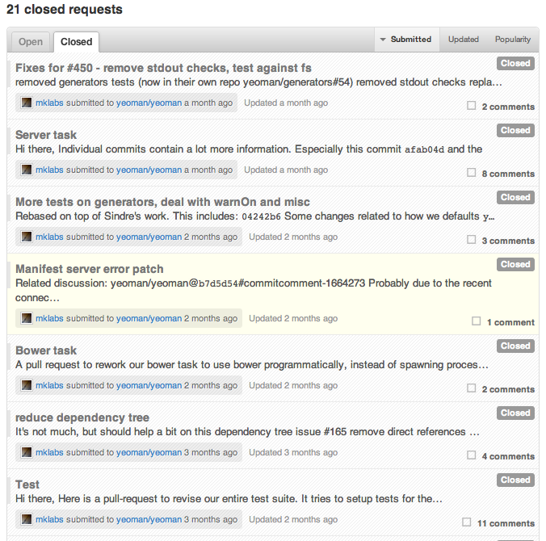

---

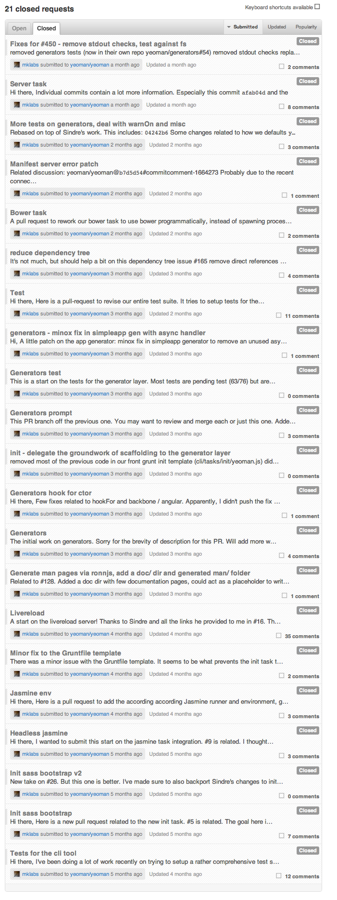
Moar!

## Launch

*September 10, 2012*

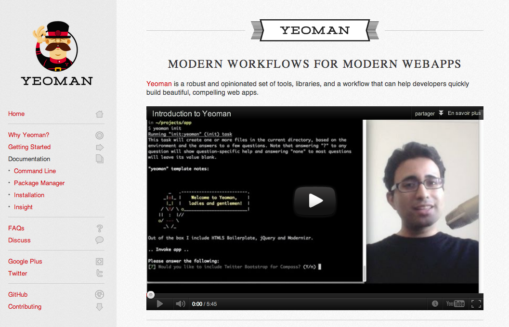

## GitHub

[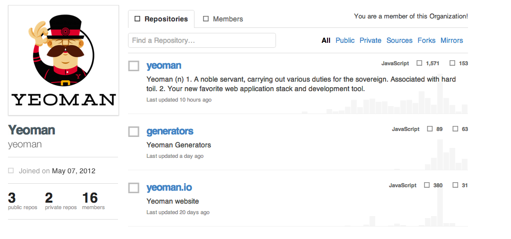](https://github.com/yeoman)

## Gplus

[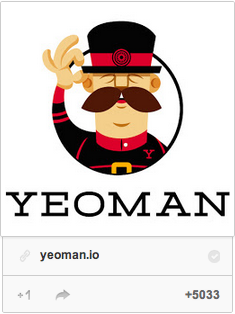](https://plus.google.com/101063139999404044459/posts)

## Twitter

## What is Yeoman

> The Yeoman CLI presents a command-line interface for creating, building, maintaining, and shipping a project.

*Abstraction on top of*

<ul style="margin-top: 60px;">
  <li>a package manager (<a href="http://twitter.github.com/bower/">Bower</a>)
  <li>a build tool (<a href="http://gruntjs.com/">grunt</a>)
  <li>a scaffolding system (<a href="https://github.com/yeoman/generators">yeoman-generators</a>)
  <li>and a built-in <a href="http://livereload.com/">LiveReload</a> compatible server
</ul>

## Bower

> Bower is a package manager for the web. Bower lets you easily install assets
> such as images, CSS and JavaScript, and manages dependencies for you.

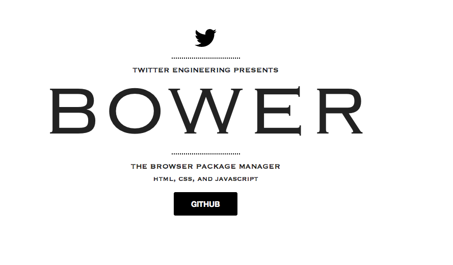

## Grunt

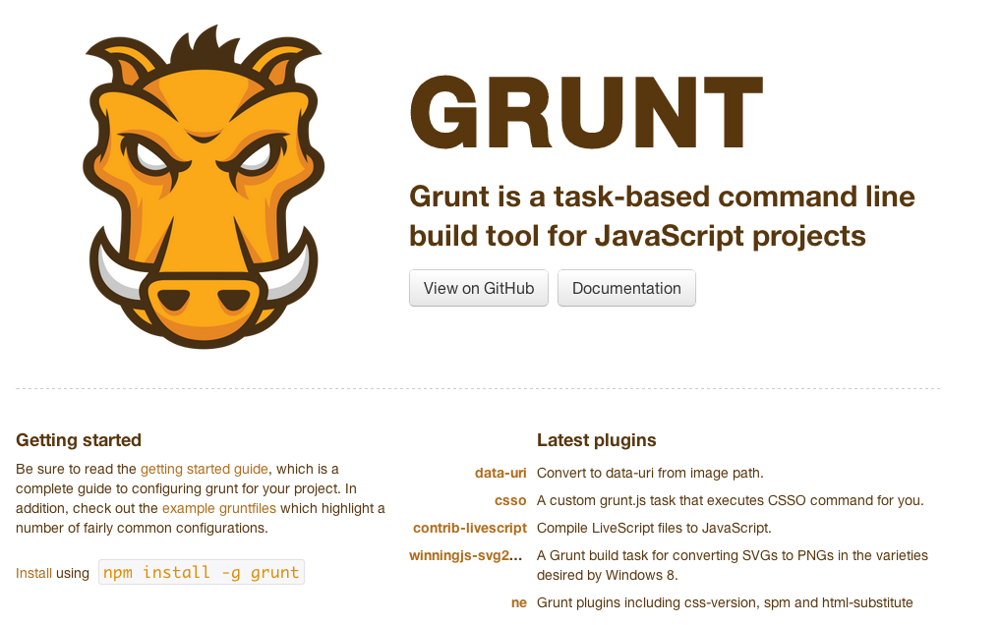

## Yeoman Generators

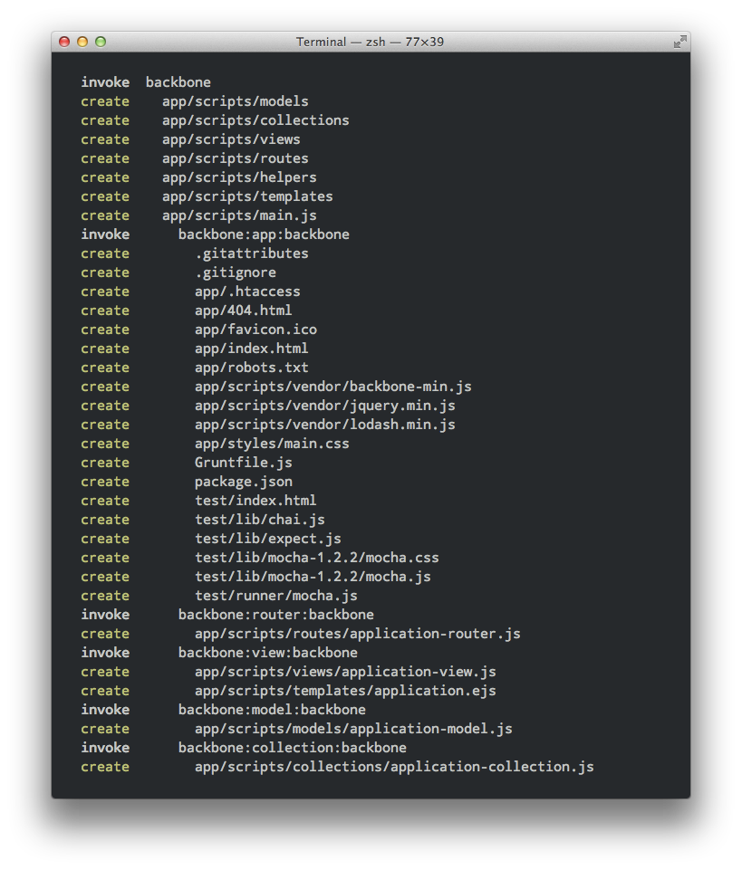

---

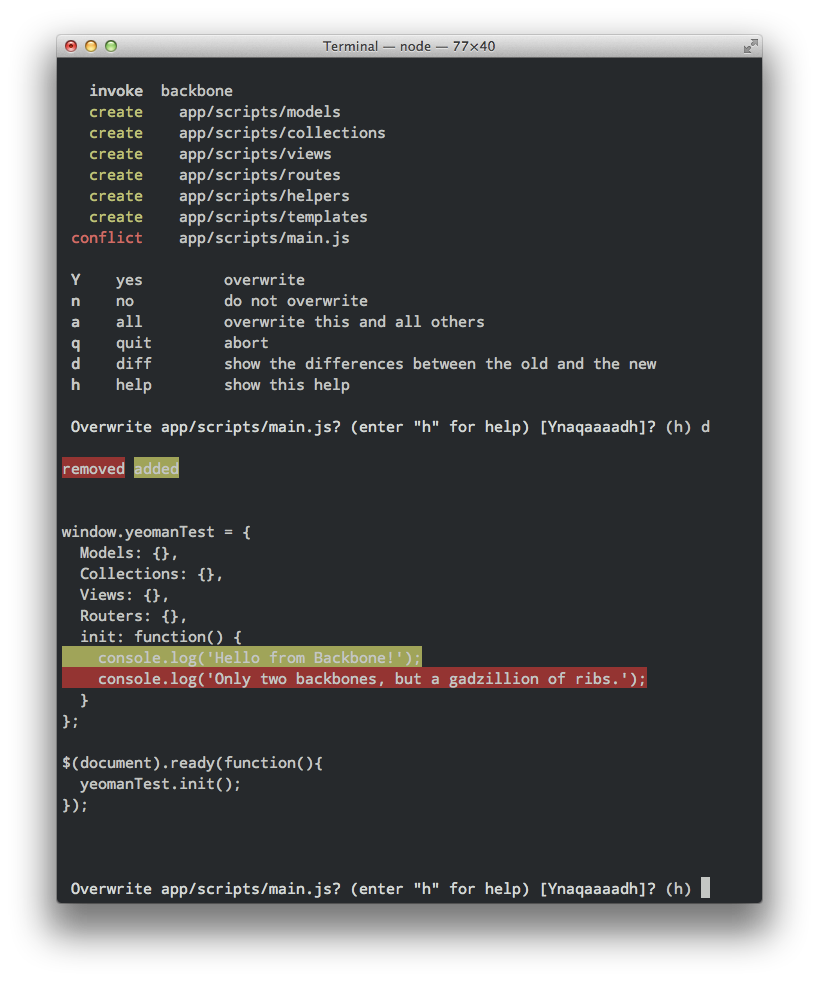

## LiveReload

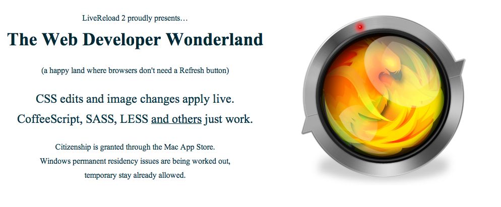

---

> We think you should go from idea to rough prototype in 10 min

## Yeoman

- Limit the time spent on writing boilerplate for your app.
- Automate as much of your workflow as possible
- Reduce friction for the things you should be doing, like testing.

---

Yeoman is an open source set of tools to accelerate building compelling webapps.

- Seamless integration of successful open source projects
- Authoring abstractions, linting, testing, build tools, generators
- Smooth developer ergonomics

## Directory Structure

<pre><code>
.
├── package.json
├── Gruntfile.js
├── app
│   ├── 404.html
│   ├── favicon.ico
│   ├── images
│   ├── index.html
│   ├── robots.txt
│   ├── scripts
│   ├── components
│   ├── styles
│   └── templates
├── dist
├── temp
└── test
    ├── index.html
    ├── lib
    ├── runner
    └── spec
</code></pre>

## Build Tool

Built on top of Grunt

- http://gruntjs.com

## Support is included for

- **Abstractions**
  - Compass. Sass. Coffeescript.

- **Modules**
  - AMD + RequireJS. Experimental support for ES6 module syntax

- **Boilerplates**
  - Twitter Bootstrap.
  - HTML5 Boilerplate + Modernizr.

- **Testing & Build Process**
  - Mocha. Jasmine. PhantomJS.
  - r.js. OptiPNG. jpegtran.

## Package Management

Built on top of Bower

- http://twitter.github.com/bower/

## How do you update your dependent libraries?

- You read they are out of date
- Open site
- Find download
- Download to ~/Downloads
- Move to app folder
- Wire in with script tags, etc

## Why do we need package management?

- Clientside dependencies are a chore
- Common code duplicated
- Library fragmentation and disjoint communities

## Package management solutions

- allowing longer dependency chains
- structured dependencies for smart build systems
- as a library author, easier for your users, both regular install and install as a dependency

How about...

    yeoman install backbone
    yeoman install backbone.localStorage

## How do you update your dependent libraries?

> yeoman update backbone

## Generators

Inspired by Rails3 Generators.

## Generators

- We're including a bunch of generators out of the box to get you started.

- Generators can be written for any framework or workflow
- They're highly customizable. Our API supports:
  - Remotely pulling and filtering dependencies
  - Wiring, so boilerplate minimization++
  - Sub-generators for creating new models, views etc.
  and tons more!

---

## Some of our generators

## Angular

- Angular
  - angular:all
  - angular:app
  - angular:common
  - angular:controller
  - angular:directive
  - angular:filter
  - angular:route
  - angular:service
  - angular:view

## Backbone

- Backbone
  - backbone:all
  - backbone:app
  - backbone:collection
  - backbone:model
  - backbone:router
  - backbone:view

- Bbb
  - bbb:all

## Chromeapp

- Chomeapp
  - chromeapp:all

## Ember-starter

- Ember-starter
  - ember-starter:all

- Ember
  - ember:all
  - ember:app
  - ember:controller
  - ember:model
  - ember:view

## Tests Framework

- Mocha
  - mocha:generator

- Testacular
  - testacular:app

## Coming Next

<ul style="margin-top: 100px;">
  <li> Ability to configure directory structure
  <li> Better integration with existing Backend
  <li> Better documentation
  <li> Better support of MV* framework with our generators
  <li> EVERYTHNG
</ul>

---

<em style="display: block;">... Demo? ...</em>

