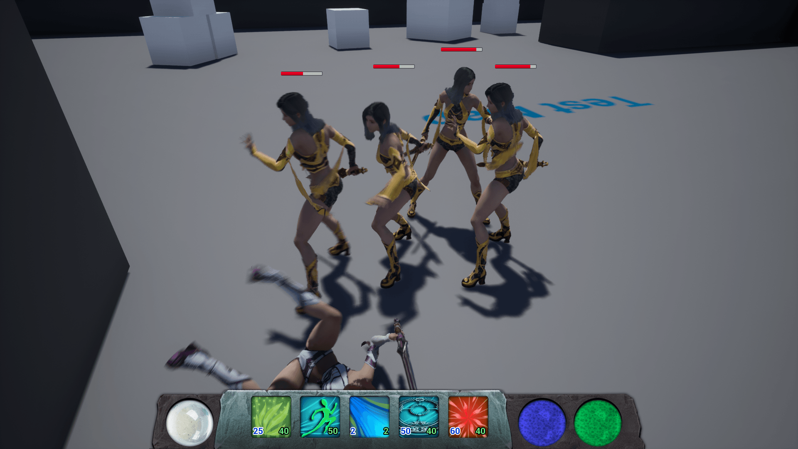

**Note**: GitHub repository doesn't exist anymore. I may provide an itch.io link in the future.

I have the pleasure to talk here about the first "prototype" game that I was able to implement recently in Unreal Engine. I called it GASP for Gameplay Ability System Prototype:

- [Download Link](https://github.com/mklabs/UE4Gasp/releases/download/v0.4.0/UE4Gasp_Windows_x64.zip)

All releases can be downloaded from [the Release page](https://github.com/mklabs/UE4Gasp/releases) (in case I continue, to download the latest version).

It is actually implementing the game developed in [Introduction to Unreal Engine 4 Ability System course on Udemy](https://www.udemy.com/introduction-to-unreal-engine-4-ability-system), with few additions and differences (sprint ability, tweaks to cost and effects, etc.)

---

---

---

This is a first throw of a 3rd person game, which is between the mechanics of an MMO and an ActionRPG. You will do most of it in about 5 minutes, there is only a test map to test the gameplay mechanics and spells.

You can play it with the keyboard / mouse or the controller, but the UI is not finalized (ie the control page is not up to date for the joystick controls). For the controller, use all the triggers to activate the spells, and the first trigger on the right to confirm a spell (for spell requiring activation).

If you have feedback, feel free;) There are bugs and things that I have not finished implementing but the main thing is there.

For the rest, I'm thinking of continuing on a Dark Souls roll / dodge mechanism, and a camera lock on system again similar to Dark Souls.

Then, develop a mechanic that would allow me to generate random levels (procedurally) in a kind of corridor with two "force fields" per zone, preventing to go back or progress to the next zone before all the enemies of the area be killed. Which would give an endless mini-game.

That's it ;)
