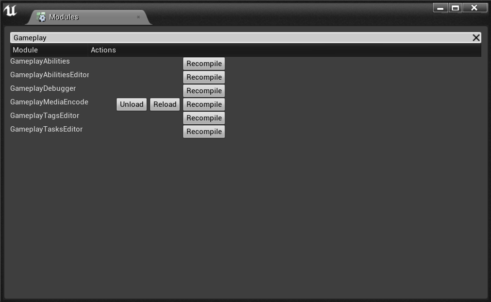

If you've worked with code plugins, you would probably know how annoying it is to not have your code plugin modules not being properly hot-reloaded when you compile your host project.

As far as I can tell, only game modules are hot-reloaded, and you'd have to rely on the Modules window to hit the "Recompile" button everytime you change the plugin to see your changes reflected in the Editor.



One way to workaround that would be to close and reopen the Editor on every re-compile, but that's not very convenient.

I experimented today with a little technique I'm gonna be using from now on. This is probably not something you want to ship with your plugin, but in the development process, it can be very handy.

### Register for Hot Reload

The trick is to use the HotReload module to bind an handler to the `OnHotReload()` event, for the HotReload module.

```cpp:title=ExampleModule.cpp noLineNumbers
// In your module StartupModule() method

// Register for hot reload
IHotReloadInterface& HotReloadSupport = FModuleManager::LoadModuleChecked<IHotReloadInterface>("HotReload");
HotReloadSupport.OnHotReload().AddRaw(this, &FExampleModule::OnHotReload);
```

In your module header file, add `OnHotReload` and `RecompileModule` method definitions, and a delegate.

```cpp:title=ExampleModule.h noLineNumbers
DECLARE_DELEGATE(FOnRecompile)

class FExampleModule : public IModuleInterface
{
public:

	FOnRecompile OnRecompile;

	/** IModuleInterface implementation */
	virtual void StartupModule() override;
	virtual void ShutdownModule() override;

	void OnHotReload(bool bWasTriggeredAutomatically);
	void RecompileModule();
};
```

In your source file, implement those methods with something similar to:


```cpp:title=ExampleModule.cpp noLineNumbers

void FExampleModule::OnHotReload(bool bWasTriggeredAutomatically)
{
	OnRecompile.BindRaw(this, &FExampleModule::RecompileModule);
	GEditor->GetTimerManager()->SetTimerForNextTick(OnRecompile);
}

void FExampleModule::RecompileModule()
{
	IHotReloadInterface& HotReloadSupport = FModuleManager::LoadModuleChecked<IHotReloadInterface>("HotReload");
	const bool bRecompileSucceeded = HotReloadSupport.RecompileModule(
        // Update this name to match your module name
		FName("ExampleModule"),
		*GLog,
		ERecompileModuleFlags::ReloadAfterRecompile | ERecompileModuleFlags::FailIfGeneratedCodeChanges
	);
}
```

You can do without the TimerForNextTick, but you might have the hot-reload kick in for your plugin and have it recompiled two or three times (in my testing). I ended using a timer to delay the recompilation of the module which fixed the issue for me.

Don't forget to update the FName passed to `IHotReloadInterface::RecompileModule()` to match your actual module name for your plugin. And if your plugin has multiple modules, adjust the logic here to recompile each of them when the hot reload happens in the editor.

You'd probably want to clean up the event handlers on `ShutdownModule()` but since I intend to use it just for development purpose and disable this when shipping, I didn't bother ;)