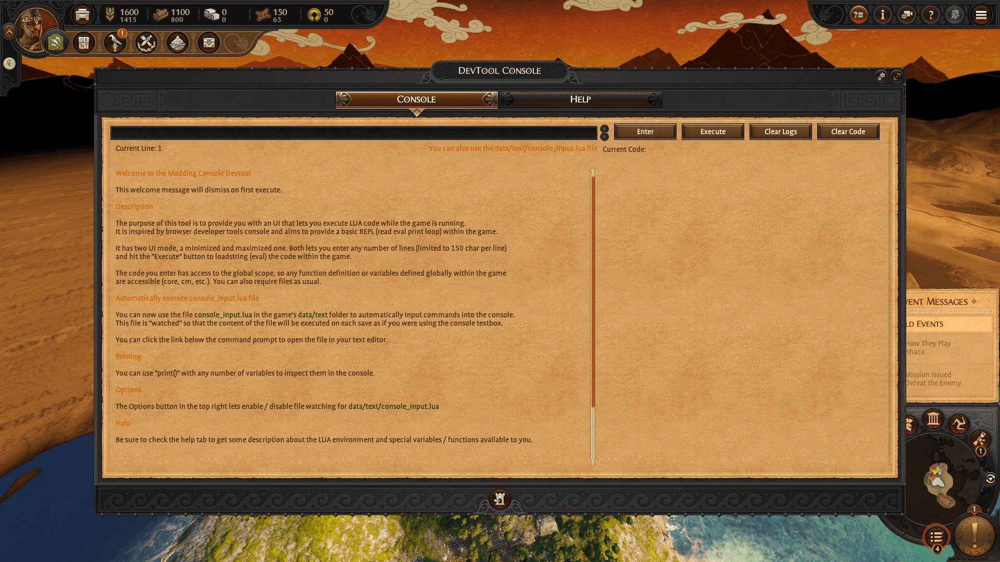
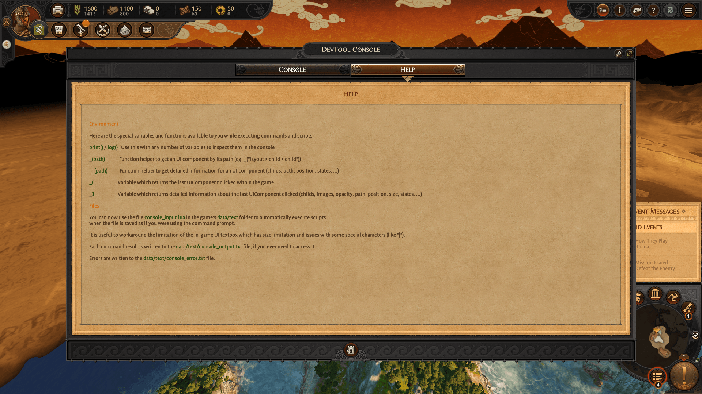
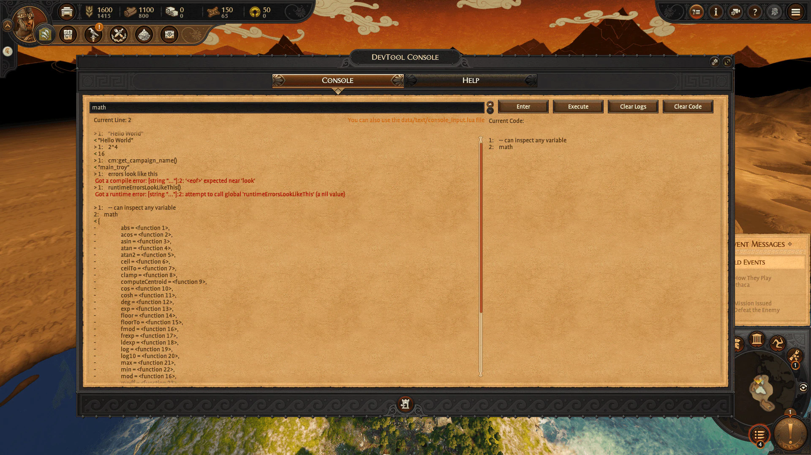
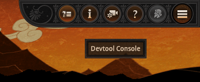
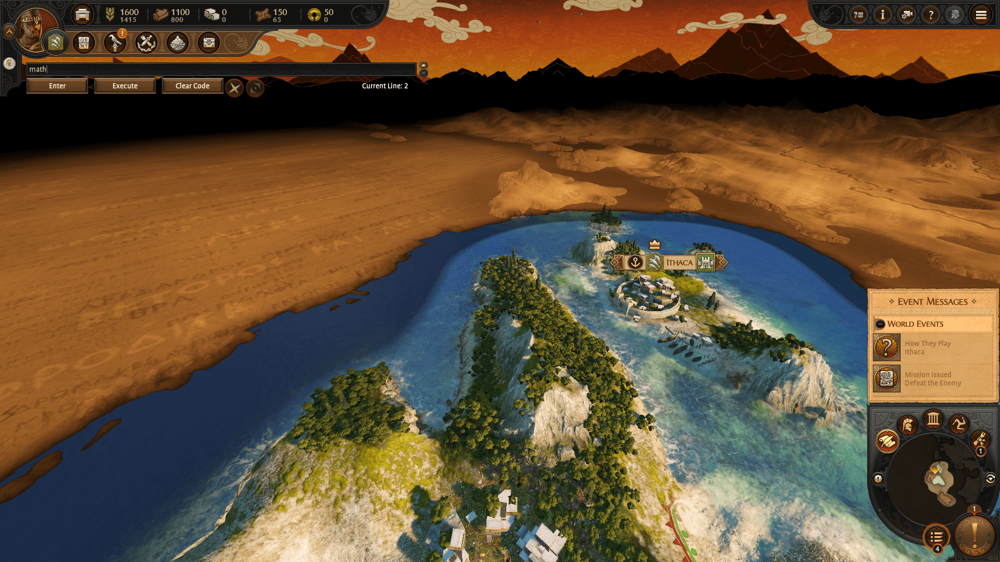

Similarly to the Warhammer 2 Devtool mod, I built this tool primarly to aid me in the process of creating more mods for Troy.

The purpose of this tool is to provide an UI that lets modders (or users) execute LUA code while the game is running. It is inspired by browser developer tools console and aims to provide a basic REPL (read eval print loop) within the game.

<Youtube id="4hXQqyQXUUo" />

