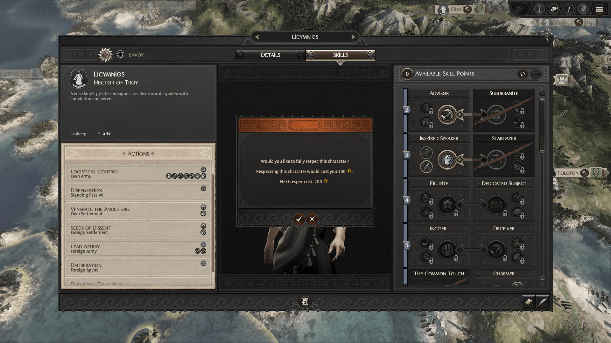

This mod is mainly an UI mod and adds a single button to the character UI to fully respec the character's skills, heroes and agents. 

Base respec cost is set to 10 gold per each level (meaning an agent or hero at lvl 10 will cost 100 gold for the first respec). Then, this base cost is doubled each time a respec is done for the character.

## Credits

It is a direct port of [One Button Respec](https://steamcommunity.com/sharedfiles/filedetails/?id=1588424293) warhammer 2 mod.

Huge thanks to **Drunk Flamingo** and **Sm0kin** for the original mod authored for Warhammer 2 upon which this mod is based off.

