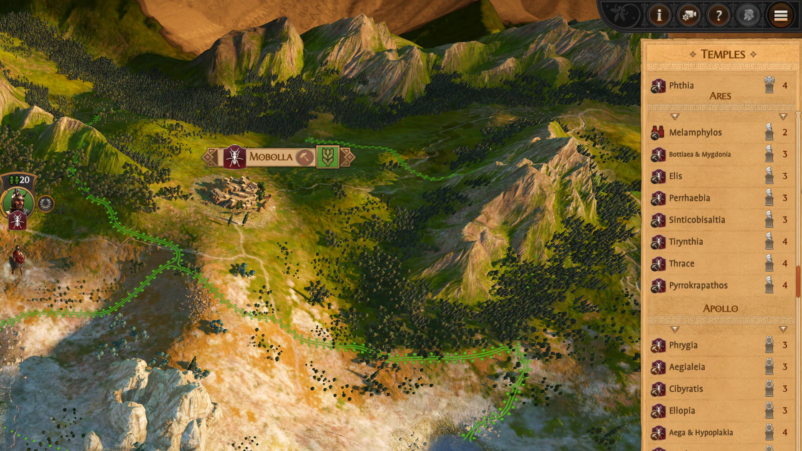
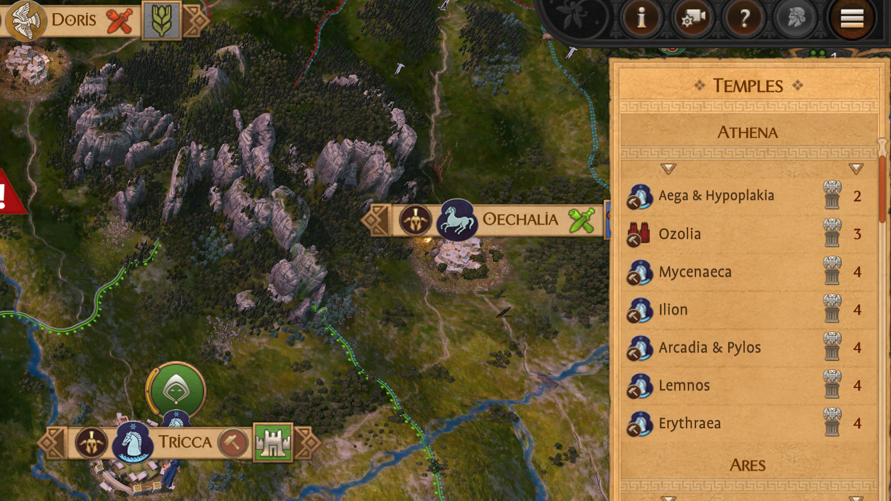
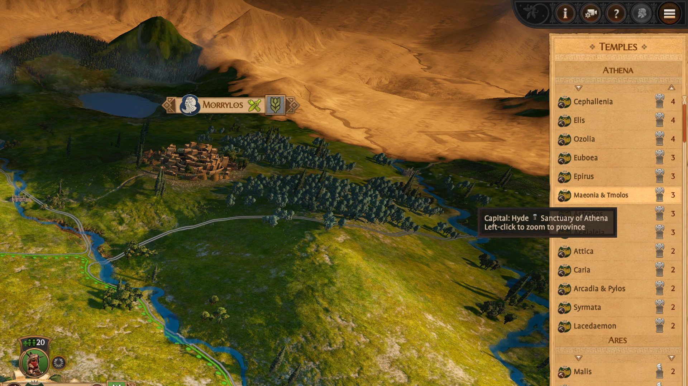

This mod adds a new UI panel to the campaign to list all owned capitals, similar to the provinces list, sorted by the temples you have built. It is useful to manage your gods favor and quickly know where you have built what.

<Youtube id="oEAebtSEKVA" />

A new button is created near the bottom right radar that lets you open / close this temples list panel.

You can then click on one of the province listed there to select the capital settlement and scroll the camera to its position. Provinces for each god can be sorted by name or temple building level.

The UI is rebuilt anytime a religion building is built or demolished, or when a settlement is acquired or lost.

