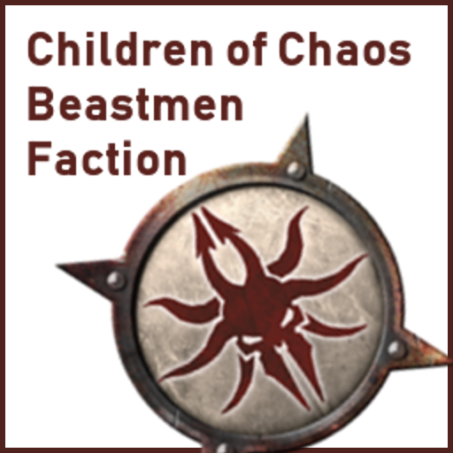
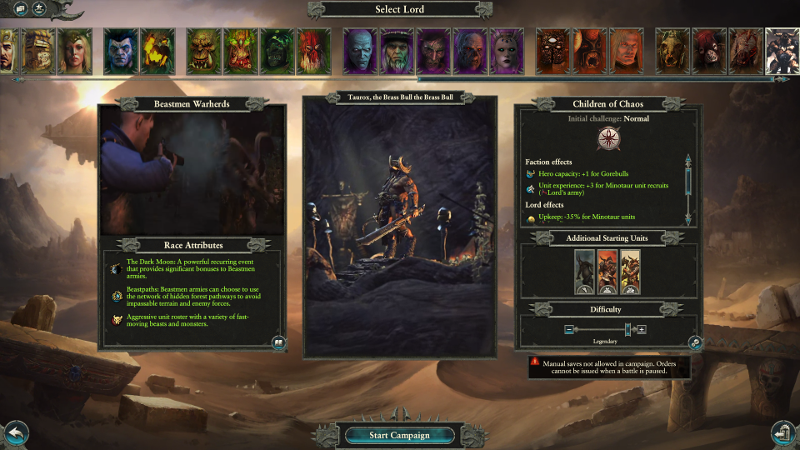
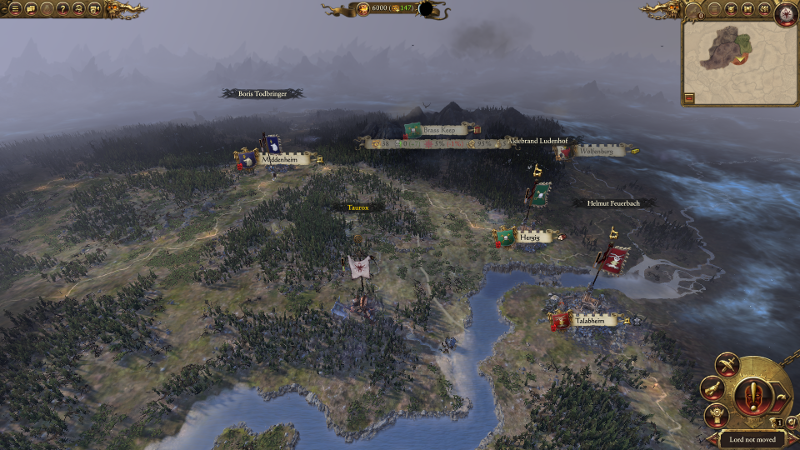
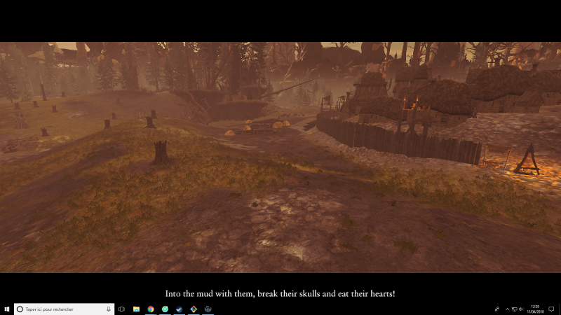
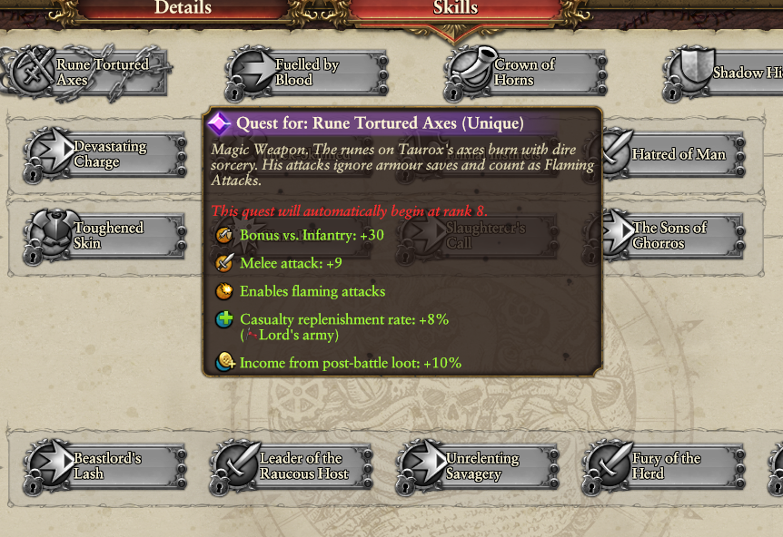
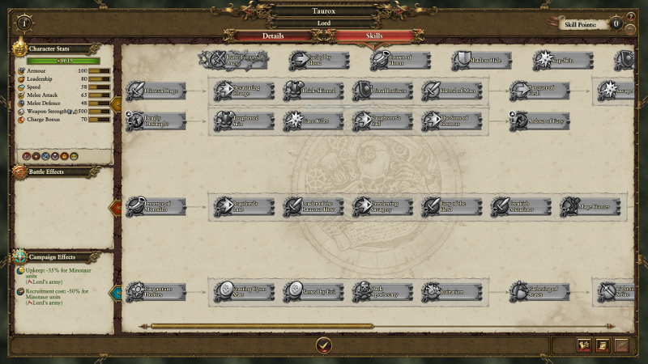
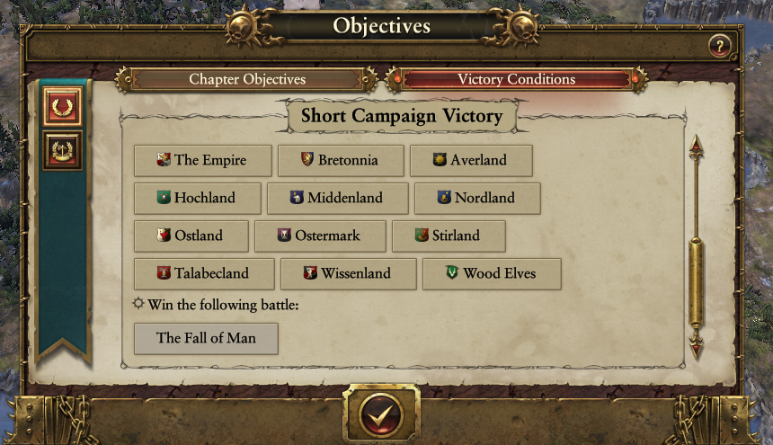

This is the very first mod I've ever made and hooked me to modding and later to Game Dev.

It implements a new Beastmen faction. Spans from DB editing to meticulous Lua scripting.

## Features

- New legendary lord: Taurox, the Brass Bull.
- New starting position: Talabecland's Great Forest.
- Custom faction/lord traits
- Custom quest battles for Taurox to unlock his Rune-Tortured Axes.
- Fully functional chapter objectives and victory conditions.
- Beastmen legendary lords (Khazrak, Malagor, Morghur) available for recruitment, using the same unlock conditions.

