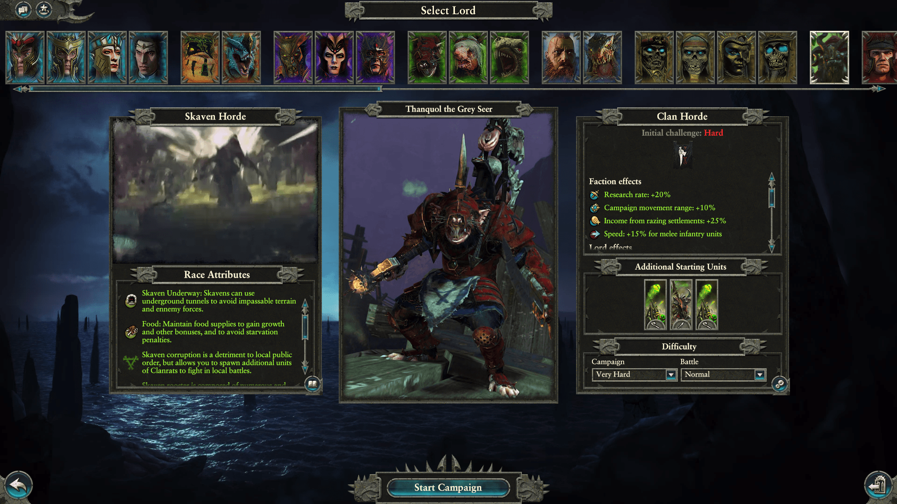

Skaven as Horde is a Total War: Warhammer II mod that implements a new Skaven faction which uses Horde mechanics. This was the first rather ambitious mod I've created, with a fairly broad surface, as modding an entierly new faction is not an easy task. Spans from DB editing to meticulous Lua scripting.

## Features

- New Legendary Lord: Thanquol the Grey Seer.
- Custom faction effects and Lord traits.
- New horde buildings, based on standard skaven ones.
- Rites functional with two new rites tailored for this horde faction.
- Technology tree with custom technology nodes.
- Custom character skill tree for Thanquol and 4 new skills for regular lords.
- Two new quests to unlock legendary items for Thanquol.
- Chapter objectives.
- Campaign victory conditions.
- Usual Skaven features such as Skaven corruption, menace from below or food management.

